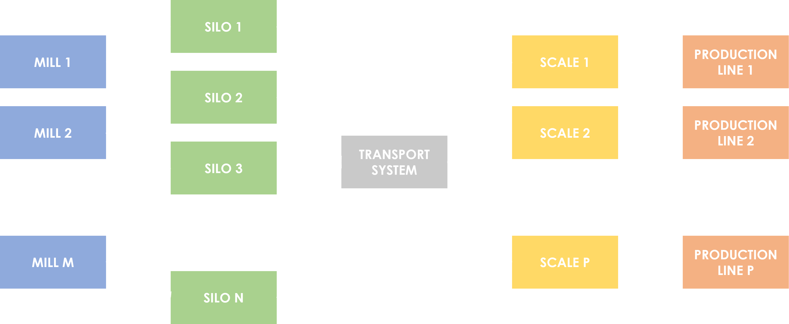

# project-particulate_transport_simulator

Simulator for analysis of availability and projection of production in an environment for the production of slabs from particulates, considering the equipment:

- Mills (source of particulate production)
- Silos (particulate intermediate storage area)
- Transport System (set of piping, threads and geared motors, for particulate transport)
- Production Lines (particulate processing station for item/plate)

The structure of the manufacturing environment can be seen in the flowchart below.

The physical principle used to build the tool is to carry out the mass balance along the equipment sets.

## Purpose

Serve as a decision-making tool, considering critical scenarios in the production environment.

## Files

### ./inputs/

The only input is the [dataset.xlsx](https://github.com/thiagoneye/project-particulate_transport_simulator/blob/main/inputs/dataset.xlsx) file, it is divided into spreadsheets containing the main parameters for each equipment.

For each equipment, new lines can be added freely so that new items of that equipment are added, considering only the following restrictions:

- Each silo must be associated with an existing mill, this is possible through the supply parameter.
- Each scale must be associated with a single and respective production line, this is possible through the ID parameter present in each equipment.

### ./outputs/

## Scripts

### main.py

### preprocessing.py

### equipments.py

Some particularities that should not be neglected:

- The transport system only supplies one scale at a time.
- When the system switches the scale to supply, a "reversal" time is required, this time can (and should) be changed in the main.py file, on line 74.

## Authorship

The particulate transport simulator was developed by [Thiago Rodrigues](https://github.com/thiagoneye/).
